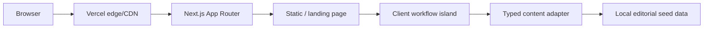
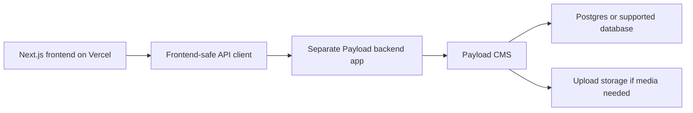

# System Architecture

## Current System

Reducto is a Next.js App Router app deployed on Vercel. The landing page is statically prerendered, with one small client island for hash-driven phase state and use-case selection.

## Frontend Modules

- `src/app/layout.tsx`: metadata, optimized fonts, and global CSS ownership.
- `src/app/page.tsx`: single landing route at `/`.
- `src/App.tsx`: client island for app composition, hash state, and local selection state.
- `src/data/reducto-content.ts`: typed content adapter for phase, use-case, gap, and schema seed data.
- `src/components/*`: focused UI components.
- `src/styles/*`: tokenized paper editorial styling.

## Future Payload Backend App

Payload should run as a separate backend/headless CMS app, not inside the browser app. The frontend should later replace `createStaticReductoContent` with calls to a small API client that returns the same `ReductoContent` shape.

Expected future shape:

Deployment boundary:

- Frontend: this Next.js app, deployed to Vercel.
- Backend: separate Payload app, deployed independently.
- Contract: backend responses should map to the existing `ReductoContent` shape.
- Rule: do not import Payload server packages into frontend components.

## Open Questions

None.
