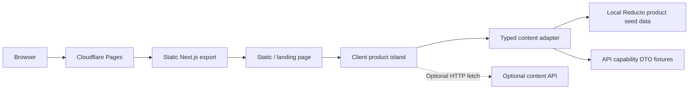
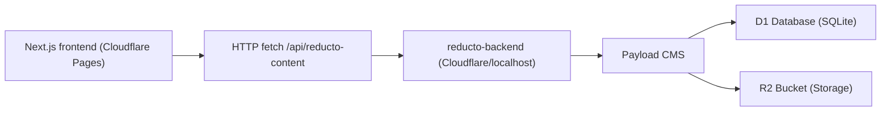

# System Architecture

## Current System

Reducto is a static Next.js App Router export deployed on Cloudflare Pages. The landing page is prerendered into `out/`, with one small client island for hash-driven platform state, industry selection, and optional frontend-safe content fetching.

## Frontend Modules

- `src/app/layout.tsx`: metadata, optimized fonts, and global CSS ownership.
- `src/app/page.tsx`: single landing route at `/`.
- `src/App.tsx`: client island for app composition, hash/scroll state, and local industry selection state.
- `src/data/reducto-content.ts`: typed content adapter and optional API fetch boundary.
- `src/data/reducto-content-validation.ts`: runtime validation for frontend-safe content responses.
- `src/data/reducto-static-content.ts`: static seed data for the Reducto platform page and future API parity.
- `src/data/payload-handoff.ts`: legacy-named DTO fixtures for public API capability previews; not server config.
- `src/data/workflow-phase-navigation.ts`: frontend-only phase anchors and panel copy for hash navigation.
- `src/components/*`: focused UI components.
- `src/components/workflow-phase-sections.tsx`: anchored workflow phase panels synced with the phase rail.
- `src/styles/*`: tokenized paper editorial styling.

## Payload Backend App Integration

Payload runs as a separate backend/headless CMS app under `reducto-backend`, completely isolated from the browser frontend. The public frontend presents Reducto document AI capabilities and can optionally consume remote content via `fetchReductoContent`, which validates a narrow response at `/api/reducto-content` and falls back to frontend-only defaults when the backend is not running or fails validation.

Current frontend capability previews cover:

- `parse`: layout-aware reading order, tables, figures, and OCR review.
- `split`: multi-document packet boundaries and page ranges.
- `extract`: schema-level fields with evidence and confidence.
- `edit`: dynamic blank, table, and checkbox filling.
- `classify`: document type, industry intent, and downstream routing.

Architecture:

Deployment boundary:

- Frontend: this Next.js app, exported statically and deployed to Cloudflare Pages.
- Backend: separate Payload app, deployed independently (e.g. to Cloudflare).
- Contract: backend responses map to the existing `ReductoContent` shape, validated at runtime.
- Rule: do not import Payload server packages, collection config, or CMS server helpers into frontend components or `src/data`.

## Open Questions

None.
