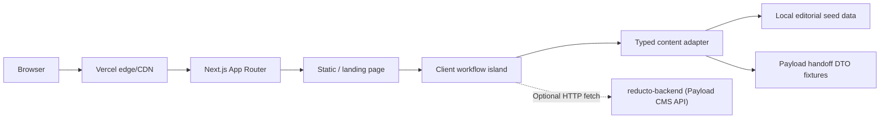
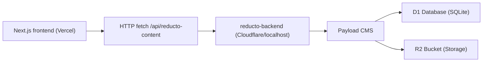

# System Architecture

## Current System

Reducto is a Next.js App Router app deployed on Vercel. The landing page is statically prerendered, with one small client island for hash-driven phase state, use-case selection, and optional frontend-safe content fetching.

## Frontend Modules

- `src/app/layout.tsx`: metadata, optimized fonts, and global CSS ownership.
- `src/app/page.tsx`: single landing route at `/`.
- `src/App.tsx`: client island for app composition, hash/scroll state, and local selection state.
- `src/data/reducto-content.ts`: typed content adapter and optional API fetch boundary.
- `src/data/reducto-content-validation.ts`: runtime validation for frontend-safe content responses.
- `src/data/reducto-static-content.ts`: static seed data for current landing content and future API parity.
- `src/data/payload-handoff.ts`: DTO fixtures for collection previews; not Payload server config.
- `src/data/workflow-phase-navigation.ts`: frontend-only phase anchors and panel copy for hash navigation.
- `src/components/*`: focused UI components.
- `src/components/workflow-phase-sections.tsx`: anchored workflow phase panels synced with the phase rail.
- `src/styles/*`: tokenized paper editorial styling.

## Payload Backend App Integration

Payload runs as a separate backend/headless CMS app under `reducto-backend`, completely isolated from the browser frontend. The frontend consumes backend remote content via `fetchReductoContent`, which validates a narrow response at `/api/reducto-content` and falls back to frontend-only defaults for landing sections and handoff previews when the backend is not running or fails validation.

Current collection handoff previews cover:

- `documents`: contract review records, source files, sections, and signoff metadata.
- `policies`: policy versioning, jurisdiction, effective dates, and exceptions.
- `audits`: checklist scope, validation checks, and remediation flags.
- `clauses`: extracted clause text, classification, and source location metadata.
- `comparisons`: baseline/candidate records and structured deltas.

Architecture:

Deployment boundary:

- Frontend: this Next.js app, deployed to Vercel.
- Backend: separate Payload app, deployed independently (e.g. to Cloudflare).
- Contract: backend responses map to the existing `ReductoContent` shape, validated at runtime.
- Rule: do not import Payload server packages, collection config, or CMS server helpers into frontend components or `src/data`.

## Open Questions

None.
